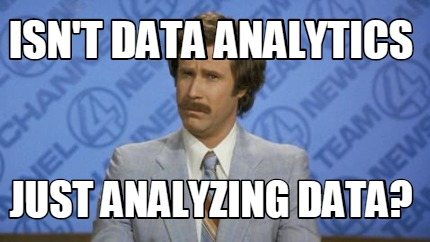

## Course Syllabus

> ### Part I: R Environment

    Lab 1: Introduction to R
    Lab 2: Data Cleaning in R
    Lab 3: Graphics in R
    Lab 4: Graphics in R (cont.)

> ### Part II: Data Analytics using R

    Lab 6: Hypothesis test with ANOVA
    Lab 7: Linear Regression, Logistic Regression
    Lab 8: Data Mining in R (K means Clustering , Associated Rule Mining) 
    Lab 9: Data Mining In R cont.  (Time Series Modeling, Time Series Forecasting)

--- 

## Project description

> - It is required to make use of the technologies studied during the course

> - You should be showing  your data visualization, analytics, conclusions, and how do you implement the Big Data project Lifecycle (that you studied in lecture) 

> - Further details will be available soon

--- .segue bg:indigo
## Introduction to R

---
## Lab Outcomes 

> 1. What is R

> 2. Invoke the R environment and examine the R workspace

> 3. R Basics 

---

## What is R

> - R is a free open source package based on the S language developed by Bell Labs

> - Statistical Programming Language used to develop statistical software 

> - Used by statisticians and data miners

> - Many statistical functions are already built in

---

## Why R

> 1. Implement statistical procedures

> 2. Provide excellent graphics functionality 

> 3. Excellent start for data analysis projects 

---

## Getting Started 

> - Where to get R?
> - Go to www.r-project.org
> - Downloads: CRAN
> - Set your Mirror: Anyone in the USA is fine.
> - Select Windows 95 or later.
> - Select base.
> - Select R-3.2.3 for Windows 
  - The others are if you are a developer and wish to change the source code.

---
## R Basics 

- Objects 
- Naming Convention
- Assignment 
- Built-In Functions
- Example Objects: 
  - Vectors, Lists, Data Frames
- Control Statements 
- Functions  
- Workspace

---

## Objects

- Objects should have names
- Object Types: vector, matrix … etc.
- Object Attributes
    - mode: numeric, character, boolean
    - length: number of elements in object
- Object Values
    - assign a value
    - create a blank object


--- 

## Naming Convention 

> - must start with a letter `(A-Z or a-z)`
> - can contain letters, digits (0-9), and/or periods `“.” ex: Var1.1`
> - case-sensitive
  - mydata different from MyData
> - do not use underscore `“_”`

---

## Assignment

`“<-”` used to indicate assignment


```r
x <- 1
y <- 3
z <- 4 
x * y * z
```

```
## [1] 12
```

`Note:` Type determined automatically when variable is created with "<-" operator 

---

## Built-In Functions
- actions can be performed on objects using functions
- have arguments and options
- provide a result
- parentheses `()` are used to specify that a function is being called

### Example Functions


```r
rep (1,10)
```

```
##  [1] 1 1 1 1 1 1 1 1 1 1
```


```r
seq (2,6)
```

```
## [1] 2 3 4 5 6
```

---
### Example cont.


```r
seq (4,20, by=4)
```

```
## [1]  4  8 12 16 20
```

```r
x <- c (2,0,0,4) 
x * 4 
```

```
## [1]  8  0  0 16
```


```r
sqrt(x)
```

```
## [1] 1.414214 0.000000 0.000000 2.000000
```

---
## Objects | Vectors
- A series of numbers 
- Created with:
  - `c()` to concatenate elements or sub-vectors 
  - `rep()` to repeat elements or patterns 
  - `seq()` or m:n to generate sequences 

---

#### Example: 

```r
X <- c(2,0,0,9)
Y <- seq(2,5) #sequence of integers between 2 & 5
Z <- rep(1,4) #repeat the number 1, 4 times 
X+Y+Z
```

```
## [1]  5  4  5 15
```

---
## Objects | Accessing Vectors 


```r
x <- c (2,0,0,4)
x [1] # Select the first element, equivalent to x[c(1)] 
```

```
## [1] 2
```


```r
x [-1] # Exclude the first element
```

```
## [1] 0 0 4
```


```r
x [1] <- 3 ; x
```

```
## [1] 3 0 0 4
```

---
#### cont.


```r
x [-1] = 5 ; x
```

```
## [1] 3 5 5 5
```


```r
x<5
```

```
## [1]  TRUE FALSE FALSE FALSE
```

```r
x [x<5] = 2 #Edits elements meeting condition
```

---

## Objects | Data Frames

- A group or collection of Vectors
- Most of the time, when data is loaded, it will be organized in a data frame

##### Example:


```r
DF <- data.frame (h=c(150,160), w=c(65,72))
DF
```

```
##     h  w
## 1 150 65
## 2 160 72
```

---
#### Example cont.

```r
DF[1]
```

```
##     h
## 1 150
## 2 160
```

```r
DF[2]
```

```
##    w
## 1 65
## 2 72
```

---

#### Example cont.


```r
DF[1,]
```

```
##     h  w
## 1 150 65
```

```r
DF[2,]
```

```
##     h  w
## 2 160 72
```

```
Q1:DF[1,2] ?
Q2:DF[-1,2] ?
```

---

## Objects | Lists
- Collections of related variables 
- Similar to records in C 
- Created with list function 
- Access to components follows similar rules as for data frames, the following all retrieve x:

```r
point <- list(x = 1, y = 1) 
point$x;point['x'];point[1];point[-2] 
```

```
## [1] 1
```

```
## $x
## [1] 1
```

```
## $x
## [1] 1
```

```
## $x
## [1] 1
```

---

## repeat


```r
x = 1
repeat 
{ x <- x+1; 
if (x==50) 
break;}
x
```

```
## [1] 50
```

---
## while

- while (expr_1) expr_2 While expr_1 is false, repeatedly evaluate expr_2 
- break and next statements can be used within the loop 


```r
while (x!=60)
{ x <- x+1;}
x
```

```
## [1] 60
```

---

## Thanks for coming!

<div align="center">

</div>

<br>
_Eslam Ali_ `Data Scientist`
