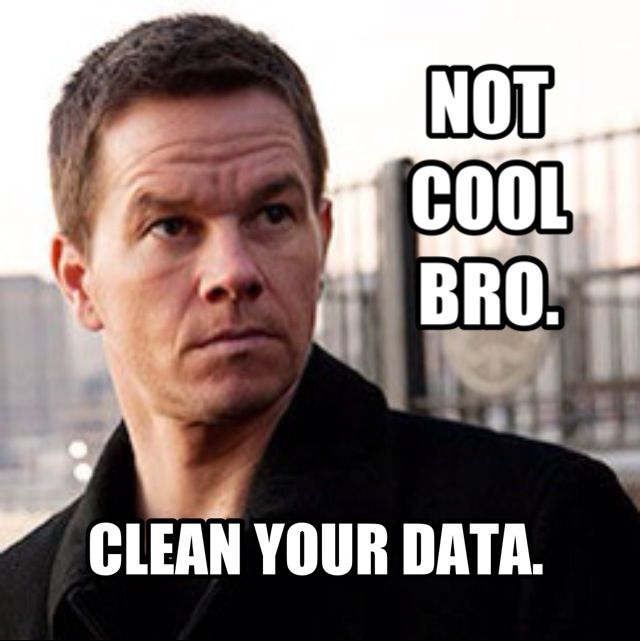

## Lab Agenda

* Accessing Data Frames with logical And\OR 
* Control Statements 
* Functions  
* Workspace 
* Writing and Reading from files

---

## Data Frame – cont-- 
```{r}
x <- data.frame("var1"=sample(1:5),"var2"=sample(6:10),"var3"=sample(11:15))
x
```

```{r}
x$var2[c(1,3)] = NA
x
```
---

## Logical And , OR

```{r}
x[x$var1 <= 3 & x$var3 >11,]
```

```{r}
x[x$var1 <= 3 | x$var3 >11,]
```

---

## Control Statements 

> - if ... else ... 

> - for loops 

> - next, break statements 

---
## If … else …

* `If` (expr_1) expr_2 `else` expr_3 The first expression should return a single logical value

* Operators `&&` or `||` may be used 

* Conditional execution of code 

---
## If … else …
```{r}
x<-3
if (x != 4){ x <- x+4
} else {x}
x
```

`Search why this is wrong?!!`
```{r}
x<-3
if (x != 4){x <- x+4}
else {x}
```

---
## for

* `Loops` are used in programming to repeat a specific block of code.
* A `for loop` is used to iterate over a vector in _R_ programming.

```{r}
x<-0
for (i in 1:20) 
{ x <- x + 1}
x
```

---
## Function Definition 
* expression
```
name <- function(arg1, arg2, ...)  
``` 
 
* Arguments can be assigned default values: `arg_name = expression`

* Return value is the last evaluated expression or can be set explicitly with `return()` 

---

## Function Examples

```{r}
square <- function(x = 10) {x * x} 
square()
```
```{r}
square(2)
```

---

### Function Examples cont.
```{r}
intsum <- function(from=1, to=10) { sum <- 0 ; for (i in from:to) sum <- sum + i; sum;}
intsum(3) # Evaluates sum from 3 to 10 
```
```{r}
intsum(to=3) # Evaluates sum from 1 to 3 ... 
```

---

## Return in Functions
```{r}
intsum <- function (from=1, to=10) 
{ sum <- 0 ; 
for (i in from:to) 
sum <- sum + i;
return(sum); }

intsum()
```
```{r}
s <- intsum()
s
```

---

## Some Notes on Functions

* You can print the arguments for a function using `args()` command 
```{r}
args(intsum) 
``` 
* You can print the contents of a function by typing only its name, without the () 
* You can edit a function using
```
n_intsum <- edit(intsum) 
```

--- 

## Debugging Functions

* Toggle debugging for a function with `debug()/undebug()` command 
* With debugging enabled, R steps through function line by line 
```{r}
debug(intsum) 
intsum(10)
```
* Use `print()` to inspect variables along the way 
* Press `<enter>` to proceed to next line 


---
## Workspace
* During an R session, all objects are stored in a temporary, working memory
* list objects
```
ls()
```
* remove objects
```
rm(name of the object you want to delete)
```
* objects that you want to access later must be saved in a “workspace”
* from the menu bar: `File->save workspace`
* from the command line: `save(x,file=“MyData.Rdata”)`

---

## Prepare Working Directory
```
getwd
```
```
setwd(“path of the data set”)
```

---
## Practice
* Create a Function that takes two arguments (x, y) and returns the “X” to the power of “Y”
ex: Power(2,3) returns 8 default return value is 1. 

---
#### Answer
```{r}
Exp <- function(x=1,y=1) 
{ z=1; for(i in 1:y) z<-z*x; return(z);}
```

---
## Data Import and Export with R

- Read data from and write data to
    - Txt Files
    - CSV files
    - EXCEL files
    - ODBC databases

---
## Practice : Read and Write Data from csv file 

```{r}
var1 <- 1:5
var2 <- (1:5)/10
var3 <- c("R","and","Data Mining","Examples","Case Studies")
df1 <- data.frame(var1,var2,var3)
names(df1) <- c('VarInt','VarReal','VarChar')
# save to a csv file
write.csv(df1,'dummmyData.csv',row.names = FALSE)
# read from a csv file
df2 <- read.csv('dummmyData.csv')
print(df2)
```

`Note`: Check the working directory and ensure that you have write access to that directory. 
You can check this with getwd() ; 

---
## Practice: Read and Write Data from Excel file
```
install.packages(“xlsx”)
```
```{r}
library(xlsx)
write.xlsx(df2, 'dummmyData.xlsx', sheetName = "sheet1", row.names = F)
df3 <- read.xlsx('dummmyData.xlsx', sheetName = "sheet1")
df3
```

---
## Read from Database 

* Package `RODBC`: provides connection to `ODBC` databases.

* Function `odbcConnect()`: sets up a connection to database

* `sqlQuery()`: sends an SQL query to the database

* `odbcClose()` closes the connection.

---
## Practice: Read from Database 

```
library(RODBC)
db <- odbcConnect(dsn = "servername", uid = "userid",pwd='password')
sql <- "SELECT * FROM lib.table WHERE ..."
myData <- sqlQuery(db, sql, errors=TRUE)
odbcClose(db)
```

--- .segue .dark .nobackground

## علم + عمل + أخلاق = حضارة


---

## Thanks for coming!

<div align="center">

</div>

<br>
_Eslam Ali_ `Data Scientist`