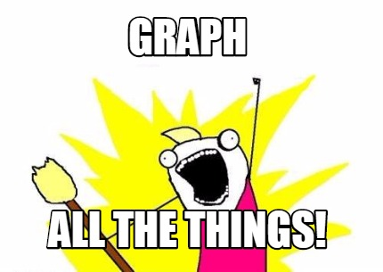

## Last Lab 

1. Introduction to Graphic in R 

2. Examples of commonly used Graphics functions

3. Common options for customizing Graphs 

---
## Today’s Lab 

- Other Plotting Functions 
    - Bar Plot
    - Pie Chart
    - Dot Plot
    - Density Plot
- Data Visualization Modalities 
- Practice 

---
## Bar Plot | Vector  

* Create barplots with the barplot(height) function, where height is a vector or matrix. 
* If height is a vector, the values determine the heights of the bars in the plot.
* Need to be based on counts, frequencies.
* You can create bar plots that represent means, medians, standard deviations, etc.
Use the `aggregate( )` function and pass the results to the barplot( ) function.

* names.arg: a vector of names to be plotted below each bar. 


---
## Bar Plot | Practice 1 

```{r,echo=FALSE}
data(ChickWeight) 
```
```
counts <- table(ChickWeight$weight)
#Creates a table with two columns, weight value and count
barplot (counts, main= 'Weight Distribution')

```

---
```{r}
counts <- table(ChickWeight$weight)
#Creates a table with two columns, weight value and count
barplot (counts, main= 'Weight Distribution')
```

--- 
## Bar Plot | Practice 2 

I want to create a barplot of the average weight grouped per day for the ChickWeight data set.
```{r}
AvgWeightPerDay <- aggregate(ChickWeight[,1],list(ChickWeight$Time), mean)
AvgWeightPerDay
```
```
barplot(AvgWeightPerDay$x, names.arg= AvgWeightPerDay$Group.1, main= "Average Weight Per Day")
```

---
####  Bar Plot | Practice 2
```{r}
barplot(AvgWeightPerDay$x, names.arg= AvgWeightPerDay$Group.1,
        main= "Average Weight Per Day")
```

---
## Bar Plot | Matrix

* If height is a matrix and the option beside=FALSE then each bar of the plot corresponds to a column of height, with the values in the column giving the heights of stacked “sub-bars”.

* If legend controls if you want to show the guiding table is the table at the top right. T means true. 

---
## Bar Plot | Practice 3
```
data(VADeaths) 
VADeaths 
barplot(VADeaths,col=rainbow(5),legend=T)
```


---
#### Bar Plot | Practice 3
```{r,echo=FALSE}
data(VADeaths) 
barplot(VADeaths,col=rainbow(5),legend=T)
```

---
#### Bar Plot | Practise 3
```{r}
barplot(VADeaths,col=rainbow(5), legend=T,beside=T)
```

---
## Dot Plots 

* Create dotplots with the dotchart (x, labels=) function, where x is a numeric vector and labels is a vector of labels for each point. 

* You can add a groups= option to designate a factor specifying how the elements of x are grouped. 

* cex controls the size of the labels.                                 

---
## Dot Plots | Practice 5 
```
data (mtcars)
mtcars
dotchart(mtcars$mpg, groups=mtcars$gear, labels = row.names(mtcars), cex =0.7, 
main = "Miles Per Gallon", xlab= "MPG")
```

---

#### Dot Plots | Practice 5 
```{r,echo=FALSE}
data (mtcars)
dotchart(mtcars$mpg, groups=mtcars$gear, labels = row.names(mtcars), cex =0.7, main = "Miles Per Gallon", xlab= "MPG")
```

---
## Density Plots 

* Kernal density plots are usually a much more effective way to view the distribution of a variable. 

* It is a way to estimate the probability density distribution of a random variable. 

* Create the plot using plot (density(x)) where x is a numeric vector.

---
#### Density Plots 
```{r}
hist(mtcars$mpg)
```

---
#### Density Plots 
```{r}
plot(density(mtcars$mpg))
```

---
## Density Plots | Practice 6 

```
hist(mtcars$mpg, prob = TRUE, col="grey")
# prob=TRUE for probabilities not counts
lines(density(mtcars$mpg), col="blue", lwd=2)
# plot a probability density distribution
lines(density(mtcars$mpg, adjust=2), lty="dotted", col="darkgreen", lwd=2)
# add another "smoother" density
```

---
#### Density Plots | Practice 6 

```{r,echo=FALSE}
hist(mtcars$mpg, prob = TRUE, col="grey")
# prob=TRUE for probabilities not counts
lines(density(mtcars$mpg), col="blue", lwd=2)
# plot a probability density distribution
lines(density(mtcars$mpg, adjust=2), lty="dotted", col="darkgreen", lwd=2)
# add another "smoother" density
```

---
## Pie Charts

* Pie charts are created with the function `pie(x, labels=)` where `x` is a `non-negative numeric vector`
indicating the area of each slice and `labels= notes` a character vector of names for the slices.

---
## Pie Chart| Practice 6 
```
slices <- c(10, 12,4, 16, 8)
lbls <- c("US", "UK", "Australia", "Germany", "France”)
pct <- slices/sum(slices)*100
# calculates percentile
lbls <- paste(lbls, pct) 
# add percent to labels (
lbls <- paste(lbls,"%",sep="") 
# ad % to labels 
pie(slices, labels = lbls, col= rainbow (length(lbls)), main="Pie Chart of Countries")
```

---
#### Pie Chart| Practice 6 
```{r,echo=FALSE}
slices <- c(10, 12,4, 16, 8)
lbls <- c("US", "UK", "Australia", "Germany", "France")
pct <- slices/sum(slices)*100
# calculates percentile
lbls <- paste(lbls, pct) 
# add percent to labels (
lbls <- paste(lbls,"%",sep="") 
# ad % to labels 
pie(slices, labels = lbls, col= rainbow (length(lbls)), main="Pie Chart of Countries")
```

---
## Plotting functions | Practice 7

```
F1 <- function (n=20)
{x1<- rnorm(n)
par (mfrow = c(3,2))
plot(x1, type= "p", main = “type: points”)
plot(x1, type= "l", main = “type: lines”)
plot(x1, type= "b", “main = “type: both”)
plot(x1, type= "o", main = “type: over plot”) 
plot(x1, type= "h", main = “type: histogram”)
lot(x1, type= "s", main = “type: steps”)}
F1()
```

---
#### Plotting functions | Practice 7

```{r,echo=FALSE}
F1 <- function (n=20)
{x1<- rnorm(n)
par (mfrow = c(3,2))
plot(x1, type= "p", main = 'type: points')
plot(x1, type= "l", main = 'type: lines')
plot(x1, type= "b", main = 'type: both')
plot(x1, type= "o", main = 'type: over plot') 
plot(x1, type= "h", main = 'type: histogram')
plot(x1, type= "s", main = 'type: steps')}
F1()
```

---
## Practise

```
f1<- function(){
x1<- rep(1:5, times=5)
#1,2,3,4,5,1,2,3,4,5,1,2,3,4,5,1,2,3,4,5,1,2,3,4,5
y1<- rep(1:5,each=5)
#1,1,1,1,1,2,2,2,2,2,3,3,3,3,3,4,4,4,4,4,5,5,5,5,5
plot(x1,y1,pch=1:25, cex =3, bg= "red", main="Data symbols 1:25")}
f1()
```

`Note:` 
Cex=n plots a figure n times the default size
Pch denotes plot symbol

---
#### Practice
```{r,echo=FALSE}
f1<- function(){
x1<- rep(1:5, times=5)
#1,2,3,4,5,1,2,3,4,5,1,2,3,4,5,1,2,3,4,5,1,2,3,4,5
y1<- rep(1:5,each=5)
#1,1,1,1,1,2,2,2,2,2,3,3,3,3,3,4,4,4,4,4,5,5,5,5,5
plot(x1,y1,pch=1:25, cex =3, bg= "red", main="Data symbols 1:25")}
f1()
```

---
## Practice
```
x1<- rep(1:5, times=5)
y1<- rep(1:5,each=5)
plot(x1,y1, pch =3, lwd= x1, cex=y1, xlim=c(0,5), ylim=c(0,5))

```

---
#### Practice
```{r,echo=FALSE}
x1<- rep(1:5, times=5)
y1<- rep(1:5,each=5)
plot(x1,y1, pch =3, lwd= x1, cex=y1, xlim=c(0,5), ylim=c(0,5))

```

---
## Practice

```
x<- rep(1:5, times=5)
y<- rep(1:5, each= 5)
plot(x,y,pch=3,lwd=x, cex=y, col = 1:25, xlim = c(0,5), ylim= c(0,5), 
main= "R plotting symbols: size and width", xlab="Width(lwd)", ylab = "Size (cex)")
```

---
#### Practice

```{r,echo=FALSE}
x<- rep(1:5, times=5)
y<- rep(1:5, each= 5)
plot(x,y,pch=3,lwd=x, cex=y, col = 1:25, xlim = c(0,5), ylim= c(0,5), main= "R plotting symbols: size and width", xlab="Width(lwd)", ylab = "Size (cex)")
```

---
## Practice
```
F2<- function()
 {
x <- 1:10; y= rep(1,10)
plot(y,x,xlab="x", ylab ="y", xlim = c(1,10), ylim = c(1,6.5), lty=1, main= "Linetypes")
for(i in 1:6) {lines(x,y=rep(i,10),lty=i)}
linenames <- paste("Type", 1:6, ":", c("solid", "dashed", "dotted", "dotdash", "longdash", "twodash"))
text(2,(1:6)+0.25,labels=linenames)
}
F2()
```

---

#### Practice
```{r,echo=FALSE}
F2<- function()
 {
x <- 1:10; y= rep(1,10)
plot(y,x,xlab="x", ylab ="y", xlim = c(1,10), ylim = c(1,6.5), lty=1, main= "Linetypes")
for(i in 1:6) {lines(x,y=rep(i,10),lty=i)}
linenames <- paste("Type", 1:6, ":", c("solid", "dashed", "dotted", "dotdash", "longdash", "twodash"))
text(2,(1:6)+0.25,labels=linenames)
}
F2()
```

---
## Practice
```
plot(1:10, 1:10,type="n")
windowsFonts
(A=windowsFont("Arial black"),
B=windowsFont("Bookman Old Style"),
C=windowsFont("Comic Sans MS"),
D=windowsFont("Symbol"))
plot(1:10, 1:10,type="n")
text(3,3, "Hello world default")
text(4,4, family ="A", "Hello world from arial black")
text(5,5, family ="B", "Hello world from Bookman Old Style")
text(6,6, family ="C", "Hello world from Comin Sans MS")
text(7,7, family ="D", "Hello world from Symbol")

```

---
#### Practice
```{r,echo=FALSE}
plot(1:10, 1:10,type="n")
text(3,3, "Hello world default")
text(4,4, family ="A", "Hello world from arial black")
text(5,5, family ="B", "Hello world from Bookman Old Style")
text(6,6, family ="C", "Hello world from Comin Sans MS")
text(7,7, family ="D", "Hello world from Symbol")

```

--- .segue .dark .nobackground

## علم + عمل + أخلاق = حضارة


---

## Thanks for coming!

<div align="center">

</div>

<br>
_Eslam Ali_ `Data Scientist`

