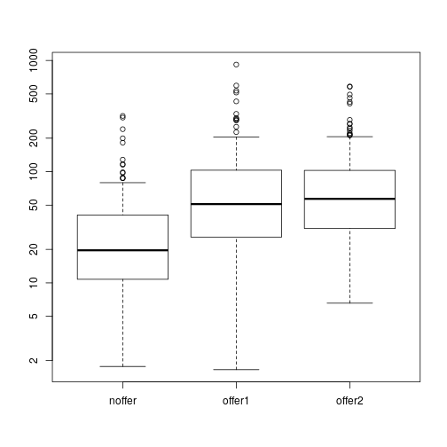
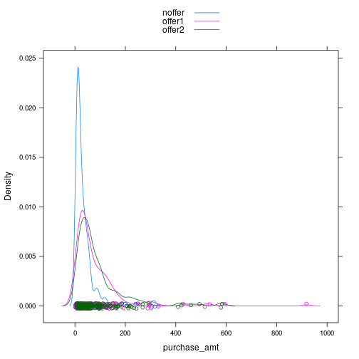
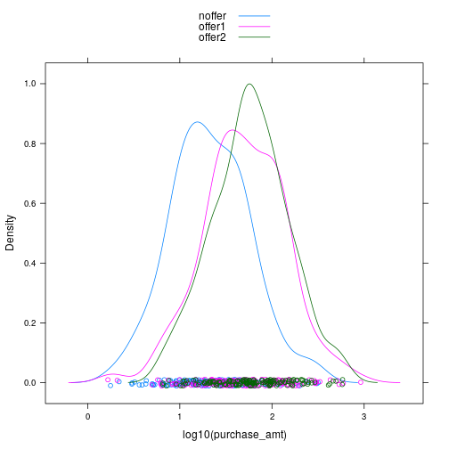
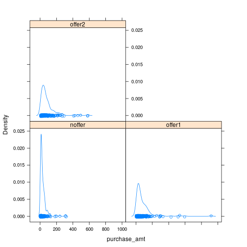
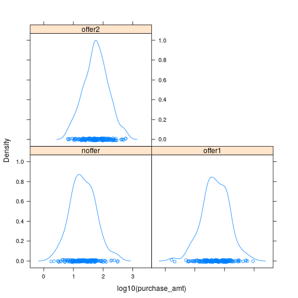
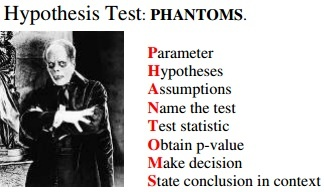

## Agenda

* General R commands
* Data Import and Export with R
* Define problem – Analysis of Variance (ANOVA) 
* Perform a Hypothesis Test with manual calculations

---
## R studio | New Commands 

```
head(dataframe, n=x) 								
#Prints the first n lines of a table 
tail(dataframe, n=x)
#Prints the last n lines of a table
```
#### Try it! 
```
head (ChickWeight, n=10)
tail (ChickWeight, n=10)
summary (Chickweight)
```

---
## R studio | Practice 
Create a copy of the chickweight without the weight column.

```
nlab1 <- ChickWeight[,2:4]
#Or 
nlab1 <- ChickWeight[,-1]
#Or 
time <- ChickWeight $Time
chick <- ChickWeight $Chick
diet <- ChickWeight $Diet
nlab1 <- data.frame (time, chick,diet) 
```

---
## R studio | New Commands 
```
dim(nlab1) 								
# tells us the dimensions of the object 
typeof (nlab1)
# tells us the datatype 
rm(nlab1) 								
# removes the object nlab1 from workspace 
ls() 
# you shouldn’t find nlab1 among the workspace objects. 
```

---
## Data Import and Export with R

* Read data from and write data to
    * CSV files
    * EXCEL files
    * ODBC databases

---
## Practice -1- Read and Write Data from csv file 
```
var1 <- 1:5
var2 <- (1:5)/10
var3 <- c("R", "and", "Data Mining", "Examples", "Case Studies")
df1 <- data.frame(var1, var2, var3)
names(df1) <- c("VarInt", "VarReal", "VarChar")
# save to a csv file
write.csv(df1, “dummmyData.csv", row.names = FALSE)
# read from a csv file
df2 <- read.csv("dummmyData.csv")
print(df2)
```

`Note :` Check the working directory and ensure that you have write access to that directory. 
You can check this with getwd() ;   

---
## Practice -2- Read and Write Data from Excel file
```
library(xlsx)
write.xlsx(df2, “dummmyData.xlsx”, sheetName = "sheet1", row.names = F)
df3 <- read.xlsx(xlsx.file, sheetName = "sheet1")
df3
```

---
## Read from Database 

* Package `RODBC`: provides connection to ODBC databases.

* Function `odbcConnect()`: sets up a connection to database

* `sqlQuery()`: sends an SQL query to the database

* `odbcClose()` closes the connection.

---
## Practice -3- Read from Database 
```
library(RODBC)
db <- odbcConnect(dsn = "servername", uid = "userid",
sql <- "SELECT * FROM lib.table WHERE ..."
myData <- sqlQuery(db, sql, errors=TRUE)
odbcClose(db)
```

---
## Hypothesis Testing 

* A statistical `hypothesis` is an assumption about a population parameter. This assumption may or may not be true.
* `Hypothesis testing` refers to the formal procedures used by statisticians to accept or reject statistical hypotheses.
The basic concept of `hypothesis` testing is to form an `assertion` and test it with data
    * `Null hypothesis (H0)` :There is no difference
    * `Alternate hypothesis (H1)` :There is a difference

---

* Suppose we are evaluating our marketing department’s incentive campaign that is trying to increase the amount of money that customers spend when they visit our online site. 

* We ran a short experiment, where visitors to our site randomly received one of two incentive offers or got no offer at all. 	

---

## Generate the Data
```
 offers = sample(c ("noffer", "offer1", "offer2"), size=500, replace=T) 
```
`Sample  ( x , size , replace=T/F)`

x: Either a vector of one or more elements from which to choose 
size: A non negative integer indicating the number of items to choose 
Replace :Should the sampling be with replacement 
```
purchasesize = ifelse(offers=="noffer", rlnorm(500, meanlog=log(25)), 
ifelse(offers=="offer1", rlnorm(500, meanlog=log(50)), rlnorm(500, meanlog=log(55)))) 

offertest = data.frame(offer=offers, purchase_amt=purchasesize)
offertest
```

---
## Examine the Data 
```
summary(offertest)
aggregate(x=offertest$purchase_amt, by=list(offertest$offer), FUN="mean") 
```

This aggregate command does the equivalent of the SQL command “SELECT avg(purchase_amt) FROM offertest GROUP BY offer”, 

##### Results :


```
##   Group.1        x
## 1  noffer 35.74412
## 2  offer1 83.45804
## 3  offer2 90.22404
```

----

Plot and determine how purchase size varies within the three groups: 	


```r
boxplot(purchase_amt ~ as.factor(offers), data=offertest, log="y")
```



* The ‘log=”y”’ argument plots the y axis on the log scale. 

`Q ]` Does it appear that making
offers increases purchase 
amount? 

---
## Use aov() to do the ANOVA: 	
```
model = aov((purchase_amt ~ offers), data=offertest)
```
Aov (formula ,data)
`Formula` :a symbolic description of the model to be fitted .
`Data` :an optional data frame, list or environment 
```
summary(model) 	
```

`p-value`: area under the tails of the appropriate student's distribution , if p-value is small (say < 0.05), then reject the null hypothesis and assume that m1 <> m2
m1 & m2 are "significantly different”

F = measure for the between group variance divided by the within group variance


---
## Use aov(cont.)
`Q1]` What is the p-value and the F-value ? 
`Q2]` Can we reject the null hypothesis ? 


```r
model = aov((purchase_amt ~ offers), data=offertest)
summary(model) 	
```

```
##              Df  Sum Sq Mean Sq F value   Pr(>F)    
## offers        2  274730  137365   16.21 1.51e-07 ***
## Residuals   497 4210398    8472                     
## ---
## Signif. codes:  0 '***' 0.001 '**' 0.01 '*' 0.05 '.' 0.1 ' ' 1
```

---

Use Tukey’s test to check all the differences of means: 	

 Tukey's test: all pair-wise tests for difference of means
```
TukeyHSD(model)
```
`Q]` Did offer1 and offer2 increase purchase size to different amounts (to the p<0.05 significance level)?


---
## Tukeys Test (Cont.)

p-value for offer2-offer1 >0.0.5 , then accept null hypothesis , which means they have similar effect

```r
TukeyHSD(model)
```

```
##   Tukey multiple comparisons of means
##     95% family-wise confidence level
## 
## Fit: aov(formula = (purchase_amt ~ offers), data = offertest)
## 
## $offers
##                    diff       lwr      upr     p adj
## offer1-noffer 47.713923  23.95393 71.47392 0.0000091
## offer2-noffer 54.479924  29.99224 78.96761 0.0000007
## offer2-offer1  6.766001 -16.38136 29.91336 0.7711191
```

`Note :` appreciable difference bet. offer1(offer2) & noffer No appreciable difference bet. offer1 & offer2

---
##  Use the lattice package for density plot: 	

* The lattice package makes it easy to split data into different groups to highlight the differences between the groups. Here, we split the purchase_amt data by offer, and plot the three offer-specific purchase_amt densityplots on the same graph. 
```
 library(lattice) 	

 densityplot(~ purchase_amt, group=offers, data=offertest, auto.key=T) 	
```

----
#### Density Plot Result 



---

Plot the Logarithms of the Data: 	

* Because the data is so left-skewed, we may want to plot the logarithms of the data to more clearly see the differences in the distributions, and the different locations of the modes 	

```
densityplot(~log10(purchase_amt),group=offers,data=offertest,auto.key=T) 	
```

---


---
#### Other Plots 

```r
densityplot(~purchase_amt | offers, data=offertest) 	
```



---
#### Other Plots 

```r
densityplot(~log10(purchase_amt) | offers, data=offertest)
```



---

Generate the example data to perform a Hypothesis Test with manual calculations: 	

* Hopefully, you won’t have to do this too often. Most statistical packages have functions that calculate a test statistic and evaluate it against the proper distribution, for the most common hypothesis tests. 

* On occasion, you may need to calculate the p-values yourself. For our example, we will calculate the Student’s t-test for difference of means (unlike Welch’s test, Student’s t-test assumes identical variances), under the alternative hypothesis that the means are not equal .

---
<iframe src='slide27.png' width=800px height=200px>
</iframe> 

---
Create a function to calculate the pooled variance, which is used in the Student’s t statistic: 	


```r
x = rnorm(10) # distribution centered at 0 
y = rnorm(10,2) # distribution centered at 2	
pooled.var = function(x, y) { 
nx = length(x) 
ny = length(y) 
stdx = sd(x) 
stdy = sd(y) 
num = (nx-1)*stdx^2 + (ny-1)*stdy^2 
denom = nx+ny-2 # degrees of freedom 
(num/denom) * (1/nx + 1/ny) 
} 	
```

---
## Examine the data

```r
mx = mean(x) 
```

```r
my = mean(y) 
```

```r
mx - my 
```

```
## [1] -2.244543
```

```r
pooled.var(x,y) 	
```

```
## [1] 0.3462188
```

---

Calculate the t statistic for Student's t-test: 	


```r
tstat = (mx - my)/sqrt(pooled.var(x,y)) 
tstat 
```

```
## [1] -3.814631
```

--- 

Perform Student’s t-test directly and compare the results: 	


```r
t.test(x, y, var.equal=T) 	
```

```
## 
## 	Two Sample t-test
## 
## data:  x and y
## t = -3.8146, df = 18, p-value = 0.001269
## alternative hypothesis: true difference in means is not equal to 0
## 95 percent confidence interval:
##  -3.480733 -1.008353
## sample estimates:
##  mean of x  mean of y 
## -0.2479934  1.9965491
```

`Q]` Does t.test() give the same results? 
>  Yes , - 3.802185

--- .segue .dark .nobackground

## علم + عمل + أخلاق = حضارة


---

## Thanks for coming!

<div align="center">

</div>

<br>
_Eslam Ali_ `Data Scientist`
